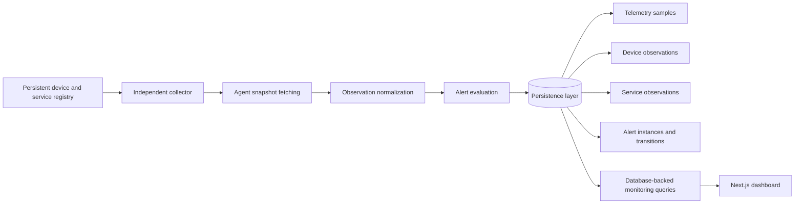
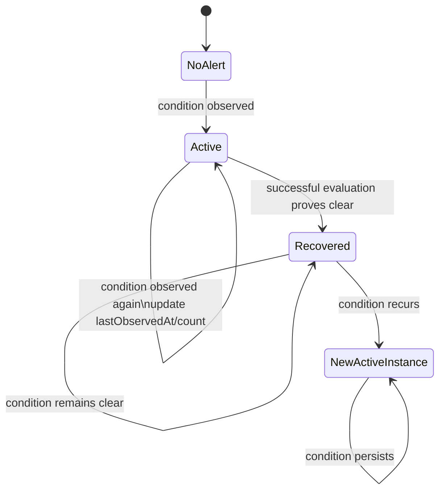
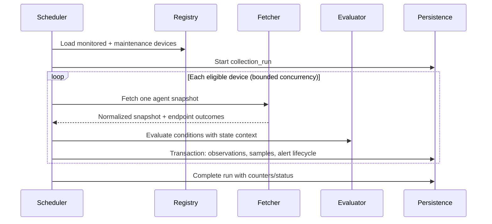

# Persistent Monitoring Architecture and Data Model

## 1. Purpose and current state

This document designs the persistence boundary for the NOC monitor. It does not introduce a database, ORM, migration, collector process, scheduler, or deployment change.

Today the Next.js monitoring path reads the code/config-based device registry, fetches agent endpoints through `getMonitoredDeviceSnapshots()` / `fetchAgentSnapshot(device)`, evaluates the latest snapshots with `evaluateMonitoringAlerts(snapshots)`, and returns a live result. Browser refreshes happen every 10 seconds. The FastAPI agents expose `/health`, `/api/system`, `/api/network`, and `/api/services`.

This produces accurate current state, but page/API traffic controls the effective monitoring cadence and recovery replaces the only known outage state. There is no durable observation, alert lifecycle, or historical availability record. Simulated enterprise data is a separate concern and must remain separate from this real-monitoring model.

## 2. Target architecture

The collector, rather than the browser, owns cadence. The dashboard becomes a reader of persisted current and historical state. Agent access remains outbound from a trusted collector on the private LAN; agent ports are not exposed publicly.

The first production cadence should be **20 seconds**. This is responsive enough for a home-lab demonstration, yields three observations per minute for sustained rules, and avoids the needless load and data volume of a 10-second default. Per-device jitter and bounded concurrency should prevent synchronized bursts. A collection cycle must not overlap the next cycle for the same device; a lease or single-active-collector rule will be needed before horizontal scaling.

## 3. Components and responsibilities

### Registry repository

Provides device and configured-service definitions through a narrow interface, independent of whether definitions come from TypeScript configuration or a database. It owns persistent identity and configuration, not observed state.

### Collector scheduler

Runs without page views, selects eligible devices, starts a collection run, invokes snapshot fetching, and records completion metrics. It skips disabled devices. It collects monitored devices and, by default, also maintenance devices so an operator can inspect what occurred during maintenance.

### Snapshot fetcher and normalizer

Reuses `getMonitoredDeviceSnapshots()` / `fetchAgentSnapshot(device)` where practical, but separates “fetch selected devices once” from dashboard request handling. It converts endpoint responses into one timestamped observation batch and records endpoint availability without persisting raw exception text. A small classified failure code such as `timeout`, `connection-refused`, `invalid-response`, or `unknown` is safer and more useful than stack traces.

### Alert evaluator and lifecycle writer

Existing pure alert rules remain the source of conditions. The lifecycle writer atomically maps each evaluated condition to an active alert instance, updates repeat observations, and recovers conditions no longer present when—and only when—the relevant check was actually evaluated successfully. It must never interpret missing data as recovery.

### Persistence and query layer

Stores configuration, observations, telemetry, alert instances, and lifecycle transitions. It exposes current-state and historical queries to Next.js. Writes for one device observation should be transactional where the database supports it.

## 4. Proposed data model

All timestamps are UTC instants. Application display converts them to the viewer's time zone. IDs should be opaque UUID/ULID-style values; stable human-readable keys remain separate. Percentage fields should use a consistent bounded numeric type and byte counters should use 64-bit integers.

### `monitored_device`

| Field | Notes |
| --- | --- |
| `id` | Durable internal primary key; never derived from display name or address |
| `stable_key` | Unique operator-facing key such as `macbook-air`; preserves current deterministic-key semantics |
| `display_name` | Mutable label |
| `monitoring_type` | Initially `agent`; extensible without mixing simulated data |
| `operational_state` | `monitored`, `maintenance`, or `disabled` |
| `expected_hostname` | Nullable identity validation value |
| `environment` | Small controlled value such as `home-lab` |
| `agent_base_url` | See URL/security decision below |
| `created_at`, `updated_at` | Configuration timestamps |

Agent URLs eventually belong in persistent device configuration when the database is the registry source, because they are routing configuration and differ per device. They are not credentials, but they reveal topology, hostnames, ports, and private addresses. The API must redact them from browser-facing responses, validate schemes and destinations to reduce SSRF risk, allow only `http`/`https`, and restrict edits to trusted administrators. Credentials or tokens, when introduced, belong in a secret manager or encrypted credential reference—not this table or URLs.

Relatively static discovered facts should live in a separate optional `device_inventory` record keyed one-to-one by `device_id`: `reported_hostname`, `platform`, `platform_release`, `architecture`, `logical_cpu_count`, `first_seen_at`, and `last_seen_at`. Update it when values change. Do not repeat these fields in every telemetry sample. `expected_hostname` remains configuration; `reported_hostname` is observation-derived inventory.

### `collection_run`

| Field | Notes |
| --- | --- |
| `id` | Primary key and batch correlation ID |
| `started_at`, `completed_at` | `completed_at` nullable while running |
| `status` | `running`, `completed`, `partial`, or `failed` |
| `duration_ms` | Nullable until completion; can also be derived |
| `devices_attempted`, `devices_succeeded` | Cycle health counters |
| `failure_summary` | Nullable bounded structured counts/codes, not exception dumps |

This table is worthwhile even at home-lab scale: it distinguishes “all devices are unreachable” from “the collector stopped running,” supports cadence diagnostics, and correlates writes from one cycle. Keep it lightweight and reference it optionally from observation rows. It is not a job queue.

### `device_observation`

| Field | Notes |
| --- | --- |
| `id` | Primary key |
| `collection_run_id` | Nullable foreign key for diagnostic/manual observations |
| `device_id` | Foreign key |
| `observed_at` | Collector observation time |
| `availability` | `online`, `partial`, or `unreachable`; persisted collections should not use `not-fetched` |
| `operational_state_at_observation` | Historical copy of the decision context |
| `unavailable_endpoints` | Bounded enum array/JSON containing endpoint names only |
| `failure_code` | Optional classified reason; no raw stack trace |

Use an index on `(device_id, observed_at desc)`. `not-fetched` remains a transient UI/collection-planning state; a skipped disabled device creates no observation.

### `system_telemetry_sample`

| Field | Notes |
| --- | --- |
| `id`, `device_id`, `collection_run_id`, `observed_at` | Identity and correlation |
| `cpu_usage_percent` | Nullable only when the metric is unavailable |
| `memory_usage_percent`, `memory_used_bytes`, `memory_total_bytes` | Memory readings |
| `disk_usage_percent`, `disk_used_bytes`, `disk_total_bytes` | Initial aggregate/root-volume readings |
| `uptime_seconds` | Agent-reported uptime |

Do not repeat hostname, platform, architecture, or logical CPU count here. Store those in `device_inventory`. Keep both byte values and percentages because exact capacity changes and rounding matter.

### `network_telemetry_sample`

| Field | Notes |
| --- | --- |
| `id`, `device_id`, `collection_run_id`, `observed_at` | Identity and correlation |
| `inbound_bytes_per_second`, `outbound_bytes_per_second` | Nullable when a rate cannot be calculated |
| `bytes_received`, `bytes_sent` | 64-bit cumulative counters |

Defer interface-level history initially. It multiplies rows, interfaces can be ephemeral, and the current dashboard primarily needs device totals. Retain interface data only in the live diagnostic response for now. Add normalized `network_interface` and `network_interface_sample` tables later if a concrete per-interface chart or alert requires them.

### `service_definition`

| Field | Notes |
| --- | --- |
| `id` | Durable internal primary key |
| `device_id` | Device running/reporting the configured check |
| `stable_key` | Immutable key unique per device, e.g. `local-ssh` |
| `name` | Mutable display name |
| `type` | `tcp` or `http`; treat HTTPS as HTTP with an `https` URL |
| `target_host`, `target_port` | Nullable TCP target fields |
| `target_url` | Nullable sanitized HTTP(S) target, without credentials |
| `enabled` | Whether this check participates in collection/evaluation |
| `created_at`, `updated_at` | Configuration timestamps |

Enforce unique `(device_id, stable_key)` and type-specific constraints: TCP requires host and port and forbids URL; HTTP requires an `http`/`https` URL and forbids TCP fields. Query strings may contain secrets and should be rejected or separately redacted; URL user-info is forbidden. Do not store headers, cookies, passwords, or tokens. Future authenticated checks should reference separately managed secrets.

The agent currently returns a name and target. Before persistence implementation, the registry-to-agent contract needs a stable service key in each configured result, or a collector-owned explicit mapping. Display name alone must not identify a service, and deriving identity from the target would turn a target edit into accidental delete/recreate behavior.

### `service_observation`

| Field | Notes |
| --- | --- |
| `id`, `service_id`, `collection_run_id`, `observed_at` | Identity and correlation |
| `status` | `up` or `down` |
| `response_time_ms` | Nullable if no timing is available |
| `http_status_code` | Nullable and only applicable to HTTP(S) |
| `failure_code` | Optional bounded classification |

Do not copy service name or target configuration into each row. Configuration edits are represented by the definition's timestamps; if audit-grade historical target attribution becomes necessary, add a versioned definition table later.

### `alert_instance`

An alert row represents one continuous occurrence of a condition, not one polling result.

| Field | Notes |
| --- | --- |
| `id` | Unique occurrence ID |
| `condition_key` | Stable logical condition, e.g. `service:macbook-air:tcp:local-ssh:down` |
| `device_id` | Foreign key |
| `service_id` | Nullable foreign key |
| `category`, `severity` | Rule metadata captured for this occurrence |
| `title`, `message` | Operator-facing occurrence text |
| `status` | `active` or `recovered` only |
| `first_observed_at`, `last_observed_at` | First/latest positive observation of this occurrence |
| `recovered_at` | Nullable; set on observed recovery |
| `observation_count` | Number of positive evaluations in this occurrence |
| `current_value`, `threshold` | Nullable structured/scalar values using a versioned, bounded schema |
| `rule_version` | Identifies evaluation semantics |

The current deterministic alert ID should become `condition_key`; it identifies the logical condition, not the database row. `alert_instance.id` identifies a particular outage. Enforce at most one active row per `condition_key` with a partial unique index in PostgreSQL, or the equivalent transactional invariant. Index `(status, last_observed_at desc)`, `(device_id, first_observed_at desc)`, and `(condition_key, first_observed_at desc)`.

Acknowledgement is deliberately absent. It is an operator workflow with actor/audit semantics, not part of condition truth, and should be designed when authentication exists.

### `alert_state_transition`

| Field | Notes |
| --- | --- |
| `id`, `alert_instance_id` | Identity and parent |
| `occurred_at` | Transition timestamp |
| `from_status`, `to_status` | `from_status` nullable for opening |
| `transition_type` | Initially `opened` or `recovered` |
| `collection_run_id` | Correlates the evidence |
| `details` | Optional bounded structured context |

Write transition rows only for lifecycle changes, not every repeated failing sample. Repeated evidence is represented by `observation_count`, `last_observed_at`, and source observations. Administrative suppression caused by maintenance/disabled state should initially be computed from device state and configuration audit history rather than overloaded into alert truth; if notifications later need a durable suppression audit, add explicit suppression events then.

## 5. Alert state machine

Exact semantics for one evaluated condition:

1. **Clear, no active instance:** make no alert write.
2. **Present, no active instance:** create an active `alert_instance`; set first/last observed to the evidence time and count to 1; append an `opened` transition.
3. **Present, active instance exists:** update that row's `last_observed_at`, increment count, and refresh current value/message as appropriate. Do not append a lifecycle transition.
4. **Clear, active instance exists:** set `status = recovered` and `recovered_at` to the first successful clear observation; append a `recovered` transition. Preserve `last_observed_at` as the last failing observation. Duration is `recovered_at - first_observed_at` for recovered occurrences and `now - first_observed_at` for currently active ones.
5. **Clear after recovery:** make no alert write.
6. **Present after recovery:** create a **new alert instance** with the same `condition_key` and a new `id`. Never reopen the prior row. This preserves outage count, inter-outage time, and per-occurrence duration.

Lifecycle evaluation and writes must be atomic and idempotent for a collection run. A unique source/evaluation identity should prevent retrying the same run from incrementing `observation_count` twice. Concurrent collectors must lock by condition or rely on the one-active-condition database constraint plus retry.

An agent outage uses exactly the same semantics with `agent:<device-stable-key>:unreachable`. A reachable observation recovers it. An endpoint timeout or absent snapshot does **not** prove that unrelated metric/service alerts recovered; those alerts remain active with unchanged `last_observed_at` until their checks can be evaluated again.

### Partial telemetry

Use one stable key, `agent:<device-stable-key>:partial`, regardless of which endpoint subset is unavailable. Store the current sorted endpoint set in `current_value` and persist each device observation's `unavailable_endpoints`. Thus `network` followed by `network + services` updates the same active occurrence and count. This models the logical problem—degraded agent telemetry—without fragmenting one incident into overlapping alerts, while observations retain enough detail to explain how it changed.

## 6. Operational-state semantics

| State | Collect | Persist observations | Evaluate condition truth | Actionable |
| --- | --- | --- | --- | --- |
| `monitored` | Yes | Yes | Yes | Yes |
| `maintenance` | Yes by default | Yes | Yes | No |
| `disabled` | No | No | No | No |

Maintenance suppresses actionability, not reality. Entering maintenance does not recover an active alert. While collection continues, a genuinely cleared condition may recover normally; a persistent condition remains the same active instance. A new condition observed during maintenance may be retained as an active but non-actionable instance, allowing truthful history without paging. On exit, a still-active condition becomes actionable without creating a duplicate. Current device state plus `operational_state_at_observation` explains the suppression context. A future notification system should record explicit suppression/delivery decisions.

Disabling a device stops collection and evaluation. Existing active alerts remain active but administratively non-actionable/stale; disabling alone is not evidence of recovery. The UI should label them “disabled / not currently evaluated” and exclude them from actionable counts. Re-enabling resumes evaluation: a clear observation recovers the old occurrence, while a still-present condition continues it. If product semantics later require retiring a device permanently, add an explicit `retired` resolution reason rather than pretending it recovered.

Operational-state changes should eventually have a small configuration audit record (`device_id`, old/new state, changed at, and actor when authentication exists), because observations alone cannot explain changes during periods with no collection.

## 7. Collection flow

Use one canonical `observed_at` per device batch (collector receipt/evaluation time) while retaining agent collection timestamps only where useful for clock-skew diagnostics. Recovery requires a successful, applicable evaluation. A failed write must not be presented as a successful collection. Slow devices need per-endpoint timeouts and bounded concurrency so one host cannot stall the entire run.

## 8. Database recommendation

| Concern | SQLite | PostgreSQL |
| --- | --- | --- |
| Local setup | Excellent; one file | More infrastructure, commonly Docker/native service |
| Single local collector | Adequate | Excellent |
| Concurrent writer/query workloads | Limited single-writer model | Designed for concurrency |
| Partial unique indexes/transactions | Available, but fewer operational options | Strong fit for active-alert invariant and locking |
| Vercel/cloud access | Local file is unsuitable/ephemeral | Natural managed-service fit |
| Portfolio demonstration | Simple prototype | More representative production architecture |

Recommend **PostgreSQL as the target persistence system**. The likely split between a LAN collector and a deployed Next.js dashboard, concurrent dashboard reads, alert uniqueness guarantees, and future managed hosting favor it.

For this project, local development should also use PostgreSQL once implementation begins, ideally through an explicit developer-run local service/container. That avoids maintaining SQLite/PostgreSQL behavioral differences and migration paths. SQLite-first is acceptable only for a deliberately short, single-process prototype if preserving learning velocity outweighs parity; it should not become the deployed architecture, and SQL/ORM choices must avoid SQLite-specific assumptions. No database is introduced in this phase.

## 9. Collector location

| Option | Assessment |
| --- | --- |
| A. Next.js/Vercel scheduled execution | Independent of browsers, but cannot normally route to private LAN agents; schedule granularity/runtime limits may not suit 20-second checks. Do not expose agents to make this work. |
| B. Linux monitoring server / Acer collector | Best current fit: always-on LAN reachability, agent ports stay private, low latency, and clear separation from the browser. Needs process supervision in a later phase. |
| C. Separate cloud worker | Reliable and scalable later, but cannot reach private LAN without a VPN/tunnel or outbound ingestion design; adds security and infrastructure complexity. |
| D. FastAPI agent itself | Has local reach but wrongly couples monitoring orchestration to each monitored endpoint, complicates leader election and gives agents cross-device access. |

Recommend a **separate collector application/process on the Linux Mint Acer or another always-on LAN host**. It may share domain packages with Next.js where technically appropriate, but it should not run inside a page request or inside a monitored FastAPI agent. It writes to PostgreSQL through an encrypted connection. For a future cloud dashboard, use a private overlay network or outbound collector-to-cloud database/API connection with least-privilege credentials; never publish agent ports directly.

## 10. Retention and expected growth

At a 20-second interval, each device produces 4,320 cycles/day. Ten devices produce 43,200 device observations, 43,200 system samples, and 43,200 network samples per day. If each device has five services, service observations add 216,000 rows/day. Total is roughly 302,400 observation/sample rows/day, or 9.1 million in 30 days, before indexes. At two devices with two services each, the same model is about 34,560 rows/day. Actual storage depends heavily on indexes and row/JSON width, so measure after implementation rather than relying on a byte estimate.

Start with:

- **30 days** of high-resolution device, system, network, and service observations at the 20-second cadence.
- **90 days** of collection-run metadata, unless it proves too noisy; it is compact and useful for diagnosing collector gaps.
- **Indefinite retention** for alert instances and lifecycle transitions at home-lab scale.
- **Indefinite retention** for current device/service definitions; when deletion is introduced, prefer soft retirement or configuration audit history where identity/history must remain referentially intact.

Add daily retention cleanup only with the persistence implementation. Defer downsampling until charts or measured storage justify it; a later tier could retain 5-minute min/max/average aggregates for 12 months before deleting raw samples.

## 11. Sustained threshold design

Keep the current immediate CPU/RAM/disk rules unchanged until durable samples and lifecycle writes exist.

Consecutive-sample rules such as “three samples at or above 90%” are simple and deterministic, but their real duration changes with cadence, delayed runs, and missing samples. Elapsed-duration rules such as “at or above 90% for at least 30 seconds” represent operator intent better, but must define continuity and tolerate jitter.

Recommend **elapsed-duration semantics with a maximum sample-gap constraint**. For example, open when all applicable observations since the first breach remain above threshold for at least 60 seconds, provided no gap exceeds twice the expected interval. A clear sample resets the candidate window; an excessive gap makes the evidence unknown and pauses/resets it rather than opening an alert. This is more robust than merely counting rows. A future rule-state/candidate table or window query can support pending breaches, but it is intentionally not part of the current runtime.

## 12. Live API and registry migration

### `GET /api/monitoring/snapshots`

Migrate without abruptly changing its response contract:

1. Preserve the current live-fetch endpoint during collector/persistence validation and mark its response/source internally as `live`.
2. Add database-backed current-state queries assembled from the latest persisted device/service observations, telemetry samples, and active alert instances. Expose them behind an internal feature flag or a new versioned route while comparing results.
3. Switch the dashboard's normal refresh to the database-backed route. Its 10-second browser refresh becomes UI freshness only, not collection cadence. Return `observedAt`/staleness so the UI never implies that cached data is live.
4. Change `/api/monitoring/snapshots` to database-backed behavior if compatibility is valuable. Move direct fetching to a protected, explicitly named on-demand diagnostic endpoint such as `/api/monitoring/diagnostics/live`, with strict timeouts and authorization when authentication exists.
5. Remove the live diagnostic endpoint if it offers no operational value. Never let it write duplicate scheduled observations by default.

### Code/config registry

Introduce a domain-facing `DeviceRegistry` contract whose returned definitions match stable domain types, then implement adapters in phases:

1. Wrap the current code/config registry without changing consumers.
2. Add explicit immutable `stable_key` values for devices and services; make snapshot and alert evaluation consume those keys.
3. Add a database-backed registry adapter after schema implementation.
4. Seed/import current definitions once, preserving stable keys and deterministic condition keys.
5. Switch collector reads to the database adapter, then remove duplicate code/config ownership after validation.

Keep fetching and evaluation dependent on registry-returned domain objects, not ORM records. This allows storage to change without rewriting the monitoring domain. Configuration source must have one owner during cutover to prevent drift.

## 13. Phased implementation plan

1. **Identity and contract hardening:** define stable device/service keys, separate pure domain types from UI types, wrap the current registry, and add state-machine unit tests without persistence.
2. **Persistence foundation:** provision PostgreSQL, select the data-access approach, create reviewed migrations, repositories, constraints, retention policy, and transaction/idempotency tests.
3. **Single-cycle persistence:** persist one manually invoked collection run using existing fetch/evaluation logic; verify observations and alert open/repeat/recover/recurrence semantics.
4. **Independent collector:** run the collector on the LAN Linux host at 20-second cadence with timeouts, bounded concurrency, single-instance protection, health/lag visibility, and graceful shutdown.
5. **Read-path migration:** add database-backed current-state APIs, compare with live results, switch the dashboard, and retain a protected live diagnostic path only if useful.
6. **History and retention:** add alert history and availability views, retention cleanup, and only then evaluate aggregation/downsampling.
7. **Advanced behavior:** sustained thresholds, authenticated administrative workflows, notification delivery, and explicit suppression audit—each as a separately designed phase.

## 14. Known limitations, security considerations, and open decisions

- The current agent service payload needs a stable service identifier or an explicit registry mapping before durable service history is safe.
- Collector-to-agent traffic is unauthenticated. Keep it on a trusted private network; later authentication should use secret references and transport security, not credentials in URLs or definitions.
- A cloud-hosted dashboard/database creates an outbound dependency from the home LAN. Buffering behavior during database/network outages must be designed before cloud deployment; the initial collector can fail visibly rather than silently drop data.
- Device and service target editing creates SSRF risk. Validate schemes/ports, restrict destinations, redact topology from browser APIs, and authorize configuration changes when authentication is added.
- Collector clock and agent clocks may differ. Use collector time for lifecycle ordering and monitor clock skew if agent timestamps are retained.
- `partial` versus `unreachable` needs a canonical rule based on which endpoints succeeded. Recovery of a specific condition requires successful evidence from that condition's endpoint.
- Disk telemetry currently appears aggregate. Multi-volume identity/history should be deferred until the agent contract provides stable volume identifiers.
- PostgreSQL location remains a deployment decision: LAN-hosted maximizes local independence; managed cloud storage enables Vercel reads but introduces internet dependency and credential/network design.
- A single collector is the correct initial topology. Before multiple collectors are allowed, add leases/fencing and database-enforced idempotency.
- Alert severity/title changes across rule versions need a deliberate policy. Capturing `rule_version` and occurrence text avoids silently rewriting history.

This design intentionally stops before persistence or collector implementation.
